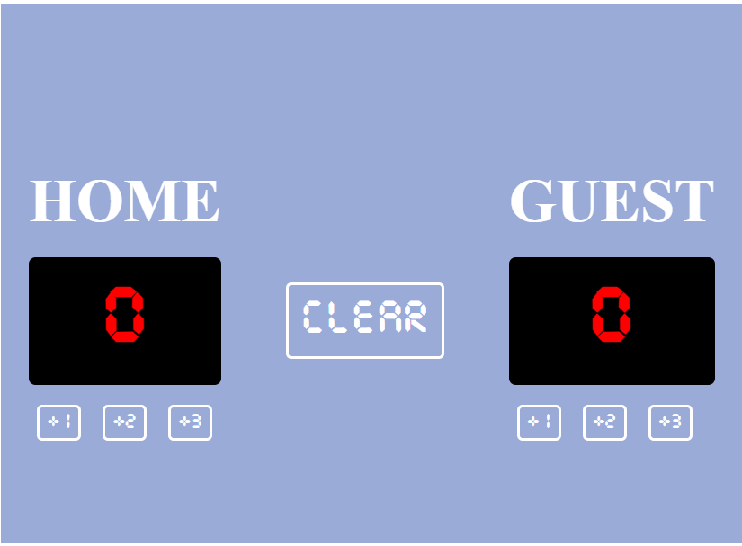

# 🏀 Basketball Scoreboard

A simple and interactive basketball scoreboard built with **HTML**, **CSS**, and **JavaScript**. This project allows users to keep score for two teams by adding points with a click. It was created as part of the **Scrimba Frontend Developer Career Path** to practice JavaScript fundamentals and DOM manipulation.

---

## 📸 Preview



---


## ✨ Features

* 🏀 Score tracking for Home and Guest teams
* ➕ Add 1, 2, or 3 points
* ⚡ Instant score updates
* 📱 Responsive layout
* 🎨 Clean basketball-themed UI
* 💻 Built with vanilla JavaScript (no frameworks)

---

## 🛠️ Technologies Used

* HTML5
* CSS3
* JavaScript (ES6)

---

## 📂 Project Structure

```text
Basketball_Scoreboard/
│
├── index.html
├── index.css
├── index.js
└── README.md
```

---

## 📖 What I Learned

While building this project, I practiced:

* Selecting DOM elements
* Updating text dynamically
* Writing reusable JavaScript functions
* Handling button click events
* Organizing HTML and CSS
* Creating responsive layouts using Flexbox

---

## 🚀 Getting Started

Clone the repository:

```bash
git clone https://github.com/PraveenVenkatesh099/Basketball_Scoreboard.git
```

Open the project folder:

```bash
cd Basketball_Scoreboard
```

Launch the application by opening:

```text
index.html
```

in your preferred web browser.

---

## 🎯 Future Improvements

* Add a **Reset Score** button
* Highlight the team currently leading
* Add a game timer
* Include period/quarter tracking
* Play sound effects when points are added
* Save scores using Local Storage
* Dark/Light mode toggle
* Mobile UI improvements

---

## 📚 Learning Source

This project was built while following the **Scrimba Frontend Developer Career Path**, focusing on JavaScript fundamentals and interactive web development.

---

## 👨‍💻 Author

**Praveen Venkatesh**

* GitHub: https://github.com/PraveenVenkatesh099

---

## ⭐ Support

If you found this project helpful or interesting, consider giving it a ⭐ on GitHub.

It helps support my learning journey and portfolio!
